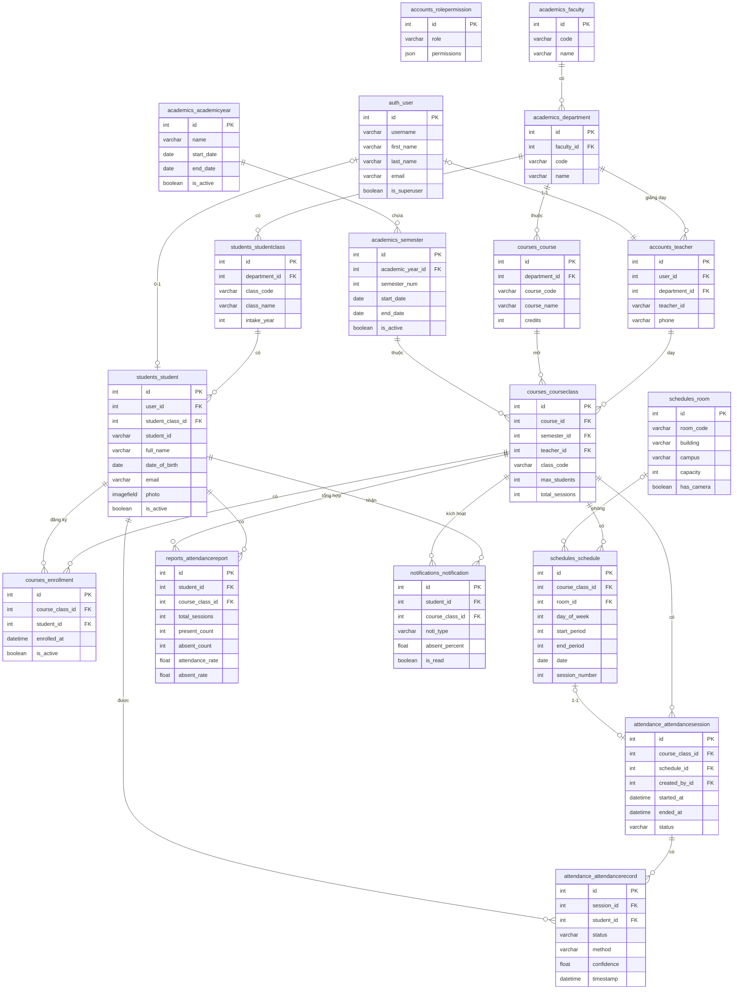
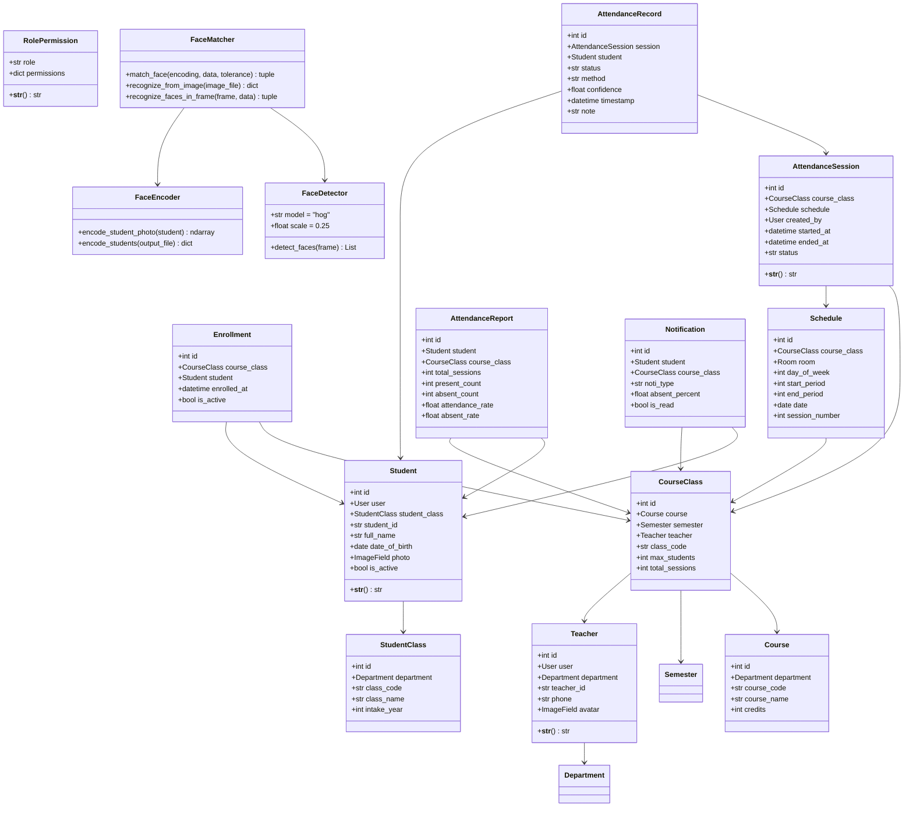
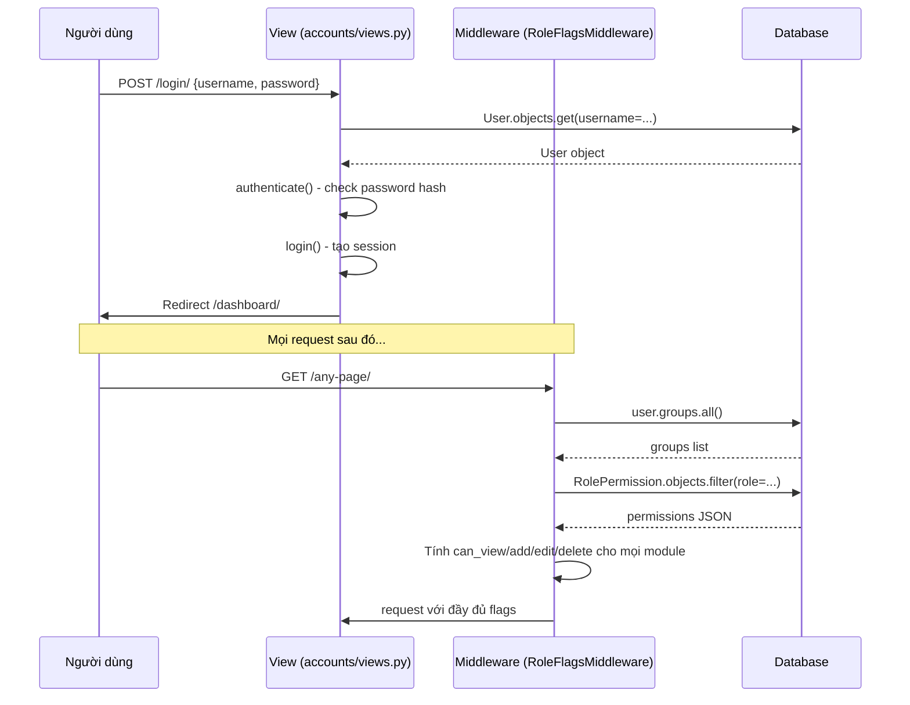
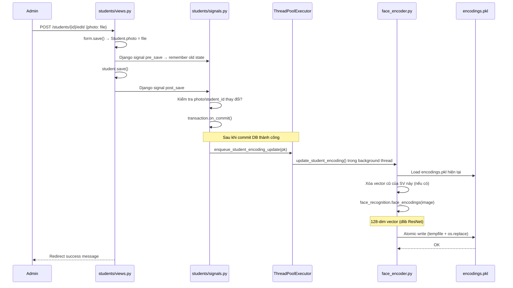
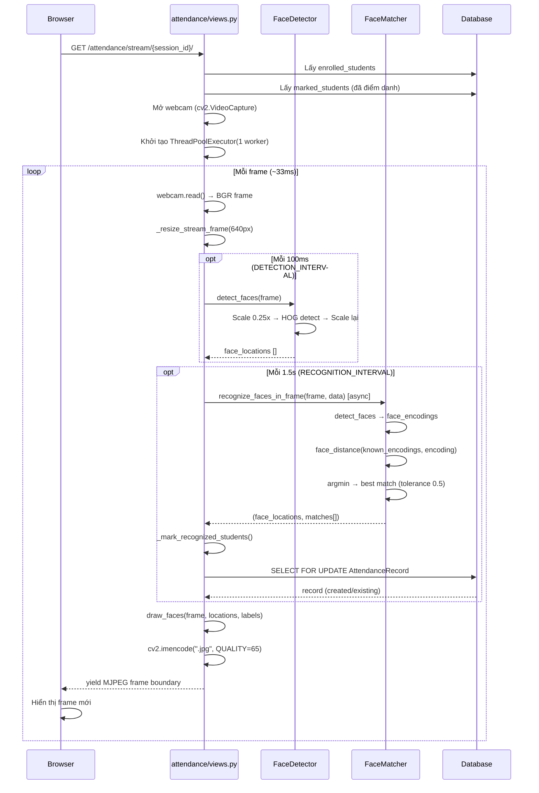
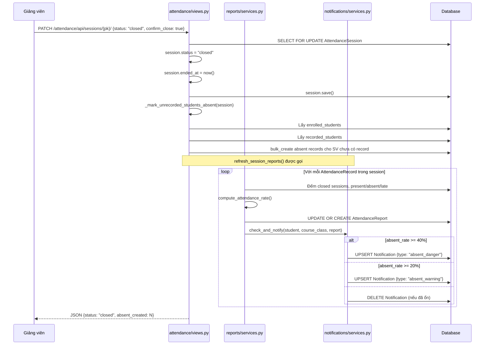

# 📘 SOFTWARE DESIGN DOCUMENT (SDD)
# Hệ thống Quản lý Điểm danh Sinh viên bằng Nhận diện Khuôn mặt
**EduFace – Face Attendance System**

---
> **Phiên bản**: 1.0 | **Ngày tạo**: 2026-06-21 | **Công nghệ**: Django 4.2 + face_recognition + OpenCV

---

## MỤC LỤC

1. [Tổng quan hệ thống](#1-tổng-quan-hệ-thống)
2. [Kiến trúc hệ thống](#2-kiến-trúc-hệ-thống)
3. [Cấu trúc thư mục dự án](#3-cấu-trúc-thư-mục-dự-án)
4. [Phân tích từng module](#4-phân-tích-từng-module)
5. [Flow nhận diện khuôn mặt](#5-flow-nhận-diện-khuôn-mặt)
6. [Flow điểm danh](#6-flow-điểm-danh)
7. [Database Design](#7-database-design)
8. [ERD Diagram](#8-erd-diagram)
9. [Class Diagram](#9-class-diagram)
10. [Use Case Analysis](#10-use-case-analysis)
11. [Sequence Diagrams](#11-sequence-diagrams)
12. [Security Analysis](#12-security-analysis)
13. [Thuật toán nhận diện khuôn mặt](#13-thuật-toán-nhận-diện-khuôn-mặt)
14. [Đánh giá hệ thống](#14-đánh-giá-hệ-thống)

---

## 1. Tổng quan hệ thống

### 1.1 Mục đích hệ thống

**EduFace** là một hệ thống quản lý điểm danh sinh viên tích hợp công nghệ nhận diện khuôn mặt (Face Recognition) trong môi trường đại học. Hệ thống được thiết kế nhằm thay thế phương thức điểm danh thủ công truyền thống bằng một quy trình tự động hóa, chính xác và hiệu quả hơn.

**Bài toán thực tế cần giải quyết:**
- Điểm danh thủ công (gọi tên, ký danh sách) tốn thời gian và dễ gian lận (sinh viên điểm danh hộ).
- Thiếu hệ thống theo dõi chuyên cần tập trung, minh bạch cho giảng viên và quản lý.
- Khó khăn trong việc cảnh báo sớm cho sinh viên có nguy cơ bị cấm thi do vắng nhiều.

**Đối tượng sử dụng:**
| Role | Mô tả |
|---|---|
| **Quản trị viên (Admin)** | Quản lý toàn bộ hệ thống, tài khoản, ngành/khoa, phòng học, phân quyền |
| **Giảng viên (Teacher)** | Mở buổi điểm danh, xem báo cáo lớp mình dạy, điều chỉnh điểm danh thủ công |
| **Sinh viên (Student)** | Xem lịch học, xem kết quả điểm danh cá nhân, nhận thông báo cảnh báo vắng |

**Lợi ích mang lại:**
- ⚡ Điểm danh tự động qua webcam, không cần gọi tên
- 🔒 Chống gian lận điểm danh hộ
- 📊 Báo cáo chuyên cần tự động theo từng lớp học phần
- 🔔 Cảnh báo tự động khi sinh viên vắng vượt ngưỡng (20%, 40%)
- 📥 Xuất báo cáo Excel đa định dạng

### 1.2 Chức năng chính

| STT | Module | Chức năng |
|---|---|---|
| 1 | **Xác thực** | Đăng nhập / Đăng xuất, phân quyền theo vai trò |
| 2 | **Quản lý tài khoản** | CRUD tài khoản Admin/Giảng viên/Sinh viên |
| 3 | **Quản lý sinh viên** | CRUD sinh viên, import/export Excel, quản lý lớp sinh hoạt |
| 4 | **Quản lý học phần** | Quản lý môn học, lớp học phần, đăng ký học phần |
| 5 | **Quản lý thời khóa biểu** | Quản lý phòng học, lịch học từng buổi |
| 6 | **Nhận diện khuôn mặt** | Encode ảnh sinh viên, nhận diện qua webcam hoặc ảnh upload |
| 7 | **Điểm danh** | Tạo buổi điểm danh, điểm danh tự động bằng khuôn mặt, điểm danh thủ công |
| 8 | **Báo cáo** | Bảng điểm danh theo lớp, lịch sử từng sinh viên, tỉ lệ chuyên cần |
| 9 | **Xuất Excel** | Xuất danh sách điểm danh, báo cáo chuyên cần với màu sắc |
| 10 | **Thông báo** | Cảnh báo vắng mặt tự động, đánh dấu đã đọc |
| 11 | **Hệ thống học thuật** | Quản lý năm học, học kỳ, khoa, ngành |
| 12 | **Dashboard** | Tổng quan thống kê hệ thống |
| 13 | **Phân quyền** | Ma trận quyền động (view/add/edit/delete) cho từng module |

---

## 2. Kiến trúc hệ thống

### 2.1 Kiến trúc tổng thể

Dự án tuân theo kiến trúc **MVT (Model–View–Template) Monolith với Multi-App Django**, kết hợp thêm các pattern bổ trợ:

```
┌─────────────────────────────────────────────────────────────┐
│                        Browser (Client)                      │
│              HTML + CSS + Vanilla JS (Fetch API)             │
└───────────────────────────┬─────────────────────────────────┘
                            │  HTTP/HTTPS
┌───────────────────────────▼─────────────────────────────────┐
│                     Django Web Server                        │
│  ┌──────────────┐  ┌──────────────┐  ┌────────────────────┐ │
│  │  Middleware  │  │   URL Router │  │    Static Files    │ │
│  │ RoleFlagsMiddleware │  │  config/urls.py │  │  /static/, /media/ │ │
│  └──────┬───────┘  └──────┬───────┘  └────────────────────┘ │
│         │                 │                                  │
│  ┌──────▼─────────────────▼────────────────────────────────┐ │
│  │                    Views Layer                          │ │
│  │  accounts/ students/ courses/ attendance/ reports/ ...  │ │
│  └──────────────────────┬──────────────────────────────────┘ │
│                         │                                    │
│  ┌──────────────────────▼──────────────────────────────────┐ │
│  │                   Models Layer (ORM)                    │ │
│  │  Faculty, Department, Student, Course, Enrollment,      │ │
│  │  AttendanceSession, AttendanceRecord, ...               │ │
│  └──────────────────────┬──────────────────────────────────┘ │
│                         │                                    │
│  ┌──────────────────────▼──────────────────────────────────┐ │
│  │            Face Recognition Engine                     │ │
│  │  recognition/face_detector.py  → HOG + CNN detect      │ │
│  │  recognition/face_encoder.py   → 128-dim embedding     │ │
│  │  recognition/face_matcher.py   → Euclidean distance    │ │
│  │  recognition/encodings.pkl     → Vector store          │ │
│  └─────────────────────────────────────────────────────────┘ │
│                                                              │
│  ┌─────────────────────────────────────────────────────────┐ │
│  │                    Database Layer                       │ │
│  │          SQLite (dev) / MySQL (production)              │ │
│  └─────────────────────────────────────────────────────────┘ │
└─────────────────────────────────────────────────────────────┘
```

### 2.2 Các Pattern được áp dụng

| Pattern | Áp dụng tại | Mô tả |
|---|---|---|
| **MVT** | Toàn bộ project | Model-View-Template của Django |
| **Middleware** | `accounts/middleware.py` | Gắn role flags và permission flags vào mỗi request |
| **Decorator** | `accounts/permissions.py` | `@module_permission_required`, `@group_required` bảo vệ view |
| **Signal** | `students/signals.py` | Tự động encode lại khuôn mặt khi sinh viên cập nhật ảnh |
| **Service Layer** | `reports/services.py`, `notifications/services.py` | Tách biệt business logic khỏi view |
| **Repository (ORM)** | Mọi model | Django ORM thay cho SQL thuần |
| **Observer** | Django Signals | Quan sát thay đổi Student.photo → trigger re-encode |
| **ThreadPoolExecutor** | `recognition/encoding_tasks.py`, `attendance/views.py` | Xử lý bất đồng bộ cho encode và recognition |

### 2.3 Thành phần hệ thống và trách nhiệm

```
[Browser]
  └── Gửi HTTP request, hiển thị HTML/CSS/JS

[URL Router - config/urls.py]
  └── Điều hướng URL → View function tương ứng

[Middleware - accounts/middleware.py - RoleFlagsMiddleware]
  └── Gắn request.is_admin_group, request.can_view_*, 
      request.can_add_*, ... vào mọi request

[Views - accounts/, students/, courses/, attendance/, reports/]
  └── Nhận request, gọi Model/Service, trả về Template hoặc JSON

[Templates - templates/]
  └── Render HTML với dữ liệu từ View

[Models - Django ORM]
  └── Định nghĩa cấu trúc CSDL, truy vấn dữ liệu

[Face Recognition Engine - recognition/]
  └── FaceDetector: phát hiện vị trí khuôn mặt trong frame
  └── FaceEncoder: tạo vector 128 chiều từ ảnh sinh viên
  └── FaceMatcher: so sánh vector để nhận diện

[Services - reports/services.py, notifications/services.py]
  └── Business logic: tính tỉ lệ chuyên cần, tạo cảnh báo

[Signals - students/signals.py]
  └── Tự động cập nhật encodings.pkl khi Student thay đổi
```

---

## 3. Cấu trúc thư mục dự án

| Folder/File | Vai trò |
|---|---|
| `config/` | Cấu hình dự án Django: `settings.py`, `urls.py`, `wsgi.py` |
| `config/settings.py` | Cấu hình DB (SQLite/MySQL), apps, middleware, media, static |
| `academics/` | Module học thuật: Faculty, Department, AcademicYear, Semester |
| `accounts/` | Module tài khoản: Teacher, RolePermission, middleware, permissions |
| `accounts/middleware.py` | RoleFlagsMiddleware — gắn flags phân quyền vào request |
| `accounts/permissions.py` | Decorator `@group_required`, `@module_permission_required` |
| `accounts/signals.py` | Signal xử lý tài khoản |
| `students/` | Module sinh viên: StudentClass, Student |
| `students/signals.py` | Signal tự động re-encode khuôn mặt khi Student.photo thay đổi |
| `courses/` | Module học phần: Course, CourseClass, Enrollment |
| `schedules/` | Module lịch học: Room, Schedule |
| `attendance/` | Module điểm danh: AttendanceSession, AttendanceRecord, video stream |
| `attendance/views.py` | Core logic điểm danh: MJPEG stream, nhận diện real-time, xuất Excel |
| `reports/` | Module báo cáo: AttendanceReport, compute/refresh services |
| `reports/services.py` | Tính toán tỉ lệ chuyên cần, upsert AttendanceReport |
| `notifications/` | Module cảnh báo vắng: Notification, NotificationRead |
| `notifications/services.py` | Kiểm tra ngưỡng 20%/40% và tạo/cập nhật cảnh báo |
| `dashboards/` | Dashboard tổng quan hệ thống |
| `recognition/` | Engine nhận diện khuôn mặt |
| `recognition/face_detector.py` | FaceDetector: HOG model, scale 0.25 để tăng tốc độ |
| `recognition/face_encoder.py` | Encode ảnh → vector 128 chiều (dlib ResNet) |
| `recognition/face_matcher.py` | So sánh vector Euclidean distance, threshold 0.5 |
| `recognition/encoding_tasks.py` | Bất đồng bộ encode/update encodings.pkl qua ThreadPool |
| `recognition/utils.py` | Load/save encodings.pkl dùng pickle (atomic write) |
| `recognition/encodings.pkl` | File lưu trữ toàn bộ vector khuôn mặt đã encode |
| `templates/` | Tất cả file HTML, tổ chức theo app: accounts/, students/, ... |
| `templates/layouts/` | Base layout: admin_base.html, home_header.html |
| `static/` | CSS, JS, hình ảnh tĩnh |
| `media/` | Ảnh upload: student_photos/, teachers/avatars/ |
| `scripts/` | Script quản lý dữ liệu: populate_sgu_data.py (seed data) |
| `requirements.txt` | Dependencies: Django, face-recognition, opencv, pandas, openpyxl |
| `docker-compose.yml` | Cấu hình Docker (MySQL, Django) |

---

## 4. Phân tích từng module

### 4.1 Module `academics` — Hệ thống học thuật

**Mục đích**: Quản lý cơ cấu tổ chức học thuật của trường.

**Models**: `Faculty` → `Department` → `AcademicYear` → `Semester`

**Luồng xử lý:**
- Admin tạo Khoa (Faculty) → trong mỗi Khoa tạo Ngành (Department)
- Tạo Năm học (AcademicYear) → trong mỗi năm tạo Học kỳ (Semester)
- Mỗi học kỳ có `is_active` flag — chỉ 1 học kỳ active tại một thời điểm

---

### 4.2 Module `accounts` — Quản lý tài khoản

**Mục đích**: CRUD tài khoản, phân quyền động theo role.

**Models**: Django `User` (built-in) + `Teacher` (1-1 với User) + `RolePermission`

**Business Logic:**
- **3 vai trò**: Admin (Quản trị viên), Teacher (Giảng viên), Student (Sinh viên)
- **Phân quyền động**: `RolePermission` lưu JSON `{module: {view/add/edit/delete: bool}}`
- **Middleware**: Sau khi xác thực, `RoleFlagsMiddleware` đọc DB và gắn vào request:
  - `request.can_view_accounts`, `request.can_add_students`, `request.can_delete_courses`...
  - Tổng cộng ~40 shorthand flags cho 7 module

**Luồng tạo tài khoản:**
```
Admin điền form → AccountForm.clean() validate → 
Transaction.atomic() tạo User → Gán Group → 
Tạo Teacher profile (nếu GV) / Link Student (nếu SV)
```

---

### 4.3 Module `students` — Quản lý sinh viên

**Mục đích**: CRUD sinh viên, nhập Excel, quản lý lớp sinh hoạt.

**Models**: `StudentClass` → `Student`

**Quan hệ**: Student ↔ User (OneToOne, nullable) — có thể tồn tại Student chưa có tài khoản.

**Business Logic đặc biệt:**
- **Tự động re-encode khuôn mặt**: Khi `Student.photo` hoặc `student_id` thay đổi, Django Signal (`students/signals.py`) tự động gọi `enqueue_student_encoding_update()` trong một thread riêng.
- **Import Excel (CSV)**: Xử lý BOM (Byte Order Mark) UTF-8 để tránh lỗi đọc cột `student_id`.
- **Export Excel**: Xuất danh sách sinh viên với thông tin đầy đủ qua openpyxl.

---

### 4.4 Module `courses` — Quản lý học phần

**Mục đích**: Quản lý môn học, mở lớp học phần, đăng ký học phần.

**Models**: `Course` → `CourseClass` → `Enrollment`

**Hierarchy nghiệp vụ:**
```
Course (Môn học, VD: "Nhập môn lập trình - 810001")
  └── CourseClass (Lớp HP cụ thể, 1 môn nhiều lớp, VD: DCT1251)
       └── Enrollment (SV đăng ký lớp HP)
```

**Constraint**: `unique_together = [('course', 'semester', 'class_code')]` — một lớp HP là duy nhất trong học kỳ.

---

### 4.5 Module `schedules` — Thời khóa biểu

**Mục đích**: Quản lý phòng học và lịch học từng buổi.

**Models**: `Room` + `Schedule`

**Schedule**: Mỗi bản ghi = 1 buổi học (gắn với `CourseClass`), có: `day_of_week`, `start_period`, `end_period`, `date`, `session_number`, `room`.

**Constraint**: `unique_together = [('course_class', 'date')]` — mỗi lớp chỉ có 1 buổi trên 1 ngày.

---

### 4.6 Module `attendance` — Điểm danh (**Module cốt lõi**)

**Mục đích**: Quản lý buổi điểm danh và ghi nhận kết quả.

**Models**: `AttendanceSession` → `AttendanceRecord`

**Đây là module phức tạp nhất** — xem Flow điểm danh ở Phần 6.

**Các view chính:**

| View Function | Method | Mô tả |
|---|---|---|
| `attendance_demo()` | GET/POST | Tạo buổi điểm danh / xem kết quả |
| `video_stream()` | GET | MJPEG stream từ webcam, nhận diện real-time |
| `session_list_create()` | GET/POST | REST API: danh sách / tạo session |
| `session_detail()` | GET/PATCH/DELETE | REST API: xem / sửa / xóa session |
| `record_list_create()` | GET/POST | REST API: danh sách / tạo record |
| `record_detail()` | GET/PATCH/DELETE | REST API: xem / sửa / xóa record |
| `recognize_attendance()` | POST | Nhận diện từ ảnh upload |
| `export_session_excel()` | GET | Xuất Excel buổi điểm danh |

**Hằng số quan trọng** (trong `attendance/views.py`):
- `STREAM_WIDTH = 640` — độ rộng frame stream
- `STREAM_JPEG_QUALITY = 65` — chất lượng JPEG
- `DETECTION_INTERVAL_SECONDS = 0.1` — tần suất detect khuôn mặt
- `RECOGNITION_INTERVAL_SECONDS = 1.5` — tần suất nhận diện (chậm hơn để tiết kiệm CPU)

---

### 4.7 Module `recognition` — Engine nhận diện khuôn mặt

**Mục đích**: Cung cấp khả năng phát hiện và nhận diện khuôn mặt.

Xem chi tiết tại Phần 5 và Phần 13.

---

### 4.8 Module `reports` — Báo cáo chuyên cần

**Mục đích**: Tổng hợp, tính toán và hiển thị tỉ lệ chuyên cần.

**Models**: `AttendanceReport` (1 bản ghi / sinh viên / lớp HP)

**Service `reports/services.py`:**
- `compute_attendance_rate(student, course_class)`: Tính tỉ lệ từ DB
  - Chỉ tính các buổi `status='closed'` sau ngày SV đăng ký
  - Đi trễ (late) vẫn được tính là có mặt
- `refresh_report(student, course_class)`: Upsert `AttendanceReport`
- `refresh_class_reports(course_class)`: Refresh toàn lớp
- `refresh_session_reports(session)`: Refresh sau khi đóng 1 buổi

---

### 4.9 Module `notifications` — Thông báo cảnh báo

**Mục đích**: Cảnh báo tự động khi sinh viên vắng nhiều.

**Ngưỡng cảnh báo:**
- `absent_warning` (⚠️): tỉ lệ vắng ≥ 20%
- `absent_danger` (🚨): tỉ lệ vắng ≥ 40%

**Trigger**: Sau mỗi lần sửa điểm danh (`attendance_edit()`) hoặc khi đóng buổi điểm danh, service `check_and_notify()` được gọi tự động.

---

## 5. Flow nhận diện khuôn mặt

### 5.1 Face Registration Flow (Thu thập dữ liệu)

```
Admin/Giảng viên
    │
    ▼
Upload ảnh cho sinh viên (students/views.py → Student.photo)
    │
    ▼
Django Signal (students/signals.py - post_save)
    │   Trigger khi Student.photo hoặc student_id thay đổi
    ▼
transaction.on_commit() → Thread pool bất đồng bộ
    │
    ▼
enqueue_student_encoding_update(student.pk) (encoding_tasks.py)
    │
    ▼
encode_student_photo(student) (face_encoder.py)
    │   1. Mở ảnh bằng PIL, convert RGB
    │   2. face_recognition.face_locations(image, model="hog")
    │   3. face_recognition.face_encodings(image, locations)
    │   4. Lấy vector 128 chiều đầu tiên
    ▼
Atomic write vào encodings.pkl (utils.py - save_encodings)
    │   Dùng tempfile + os.replace() để tránh corruption
    ▼
encodings.pkl được cập nhật (bổ sung / thay thế vector)
```

### 5.2 Face Training / Encoding Flow (Batch)

Khi cần encode lại toàn bộ sinh viên (VD: sau khi import batch):

```
face_encoder.py - encode_students()
    │
    ▼
Query: Student.objects.filter(is_active=True).exclude(photo="")
    │
    ▼
For each student:
    ├── Mở student.photo.path bằng PIL
    ├── Convert sang RGB array (numpy uint8)
    ├── face_recognition.face_locations(image, model="hog")
    │       → HOG (Histogram of Oriented Gradients) detection
    ├── face_recognition.face_encodings(image, locations)
    │       → dlib ResNet model → 128-dim vector
    └── Append vào data dict
    │
    ▼
pickle.dump(data, file) → encodings.pkl
    │
    ▼
data = {
    "encodings": [np.array(128,), np.array(128,), ...],
    "student_ids": ["22110001", "22110002", ...],
    "names": ["Nguyen Van A", "Tran Thi B", ...]
}
```

### 5.3 Face Recognition Flow (Real-time Webcam)

**File**: `attendance/views.py` — `_stream_frames()` + `recognition/face_matcher.py`

```
Webcam (cv2.VideoCapture)
    │
    ▼ Frame BGR (mỗi 33ms tại 30fps)
    │
    ├─── DETECTION THREAD (mỗi 100ms - DETECTION_INTERVAL_SECONDS)
    │       overlay_detector.detect_faces(frame)
    │           → Scale frame 0.25x (tăng tốc 16x)
    │           → face_recognition.face_locations(small_frame, model="hog")
    │           → Scale lại vị trí về kích thước gốc
    │       → face_locations: [(top, right, bottom, left), ...]
    │
    ├─── RECOGNITION WORKER (mỗi 1.5s - RECOGNITION_INTERVAL_SECONDS)
    │       ThreadPoolExecutor.submit(recognize_faces_in_frame, frame.copy(), data, 0.5)
    │           ↓ (chạy trong thread riêng)
    │       1. detector.detect_faces(frame) → face_locations
    │       2. cv2.cvtColor(frame, BGR→RGB)
    │       3. face_recognition.face_encodings(rgb_frame, face_locations)
    │           → 128-dim vector cho mỗi khuôn mặt
    │       4. For each encoding:
    │           match_face(encoding, data, tolerance=0.5)
    │               → face_recognition.face_distance(known_encodings, encoding)
    │               → np.argmin(distances) → best_index
    │               → if distances[best_index] <= 0.5: match!
    │               → confidence = 1.0 - distance
    │       → [(student_id, name, confidence), ...]
    │
    ▼
_mark_recognized_students(session, enrolled_students, marked_students, matches)
    │   Chỉ điểm danh sinh viên ĐĂNG KÝ lớp HP này
    │   Không điểm danh lại sinh viên đã điểm danh (marked_students set)
    ▼
_record_face_attendance(session, student, confidence)
    │   SELECT FOR UPDATE (row-level lock)
    │   get_or_create AttendanceRecord
    │   Không override quyết định thủ công (manual late/absent)
    ▼
draw_faces(frame, face_locations, labels)
    │   Vẽ hộp xanh + tên sinh viên lên frame
    ▼
cv2.imencode(".jpg", frame, JPEG_QUALITY=65)
    │
    ▼
yield MJPEG frame → StreamingHttpResponse
    │   Content-Type: multipart/x-mixed-replace; boundary=frame
    ▼
Browser nhận và hiển thị stream video
```

### 5.4 Face Recognition từ ảnh Upload

**File**: `attendance/views.py` — `recognize_attendance()`, `recognition/face_matcher.py` — `recognize_from_image()`

```
Client POST /attendance/api/recognize/
    body: {session_id, image: file}
    │
    ▼
recognize_from_image(image_file)
    │   1. load_encodings() từ encodings.pkl
    │   2. PIL.Image.open(image_file).convert("RGB") → numpy array
    │   3. face_recognition.face_locations(image, model="hog")
    │   4. face_recognition.face_encodings(image, locations)
    │   5. match_face() cho từng encoding
    │   6. Trả về match có distance nhỏ nhất
    ▼
Kiểm tra sinh viên có đăng ký lớp HP không (Enrollment.exists())
    ▼
_record_face_attendance() → Ghi AttendanceRecord
    ▼
Response JSON: {created, already_present, match, record}
```

---

## 6. Flow điểm danh

### 6.1 Luồng tổng thể

```
Giảng viên đăng nhập
    │
    ▼
Truy cập trang Điểm danh (attendance_demo)
    │   GET: Hiển thị form chọn lớp HP / buổi lịch học
    ▼
Chọn lớp HP và buổi học → POST
    │   Kiểm tra quyền: GV chỉ điểm danh lớp mình dạy
    │   Nếu đã có AttendanceSession cho buổi này → redirect đến session
    │   Nếu chưa → Tạo AttendanceSession mới (status='open')
    ▼
Trang điểm danh (session_id trong URL)
    │   Hiển thị danh sách sinh viên đăng ký lớp
    │   Tải video stream: 
    ▼
    ├── [Điểm danh tự động] Camera stream chạy
    │       → Mỗi 1.5s nhận diện khuôn mặt
    │       → Tìm sinh viên trong danh sách enrolled
    │       → Ghi AttendanceRecord(status='present', method='face')
    │       → Label hiển thị trên video: "22110001 - Nguyen Van A"
    │
    ├── [Điểm danh thủ công] GV click chọn sinh viên
    │       → Chọn trạng thái: Có mặt / Vắng / Đi trễ
    │       → POST record_detail() (PATCH)
    │       → Ghi method='manual'
    │
    └── GV nhấn "Kết thúc buổi điểm danh"
            → PATCH session_detail() {status: 'closed', confirm_close: true}
            → _mark_unrecorded_students_absent():
                Tìm sinh viên CHƯA có record → bulk_create absent records
            → session.ended_at = timezone.now()
            ▼
        Trigger refresh_session_reports() → Tính lại tỉ lệ chuyên cần
            ▼
        check_and_notify() → Tạo/cập nhật cảnh báo vắng
```

### 6.2 Logic tránh điểm danh trùng

Trong `_record_face_attendance()` (`attendance/views.py:232`):
```python
# Sử dụng SELECT FOR UPDATE để tránh race condition
record, created = AttendanceRecord.objects.select_for_update().get_or_create(
    session=locked_session,
    student=student,
    defaults={...}
)

# Không override nếu GV đã manually đánh vắng/trễ
if record.method == "manual" and record.status in {"late", "absent"}:
    return record, False, False  # Không thay đổi
```

### 6.3 Kiểm tra điều kiện sinh viên thuộc lớp

```python
# Chỉ nhận diện sinh viên ĐÃ ĐĂNG KÝ lớp HP
enrolled_students = {
    student.student_id: student
    for student in Student.objects.filter(
        enrollments__course_class=session.course_class,
        enrollments__is_active=True,
        is_active=True,
    )
}
# Sinh viên nhận diện được nhưng KHÔNG đăng ký → label "Unknown"
```

---

## 7. Database Design

### Bảng `auth_user` (Django built-in)

| Field | Type | Ý nghĩa |
|---|---|---|
| id | INTEGER PK | ID tự tăng |
| username | VARCHAR(150) | Tên đăng nhập (MSSV với SV) |
| first_name | VARCHAR(150) | Họ và tên đệm |
| last_name | VARCHAR(150) | Tên |
| email | VARCHAR(254) | Email |
| password | VARCHAR(128) | Mật khẩu (hash pbkdf2_sha256) |
| is_active | BOOLEAN | Tài khoản đang hoạt động |
| is_superuser | BOOLEAN | Quyền admin tuyệt đối |

### Bảng `accounts_teacher`

| Field | Type | Ý nghĩa |
|---|---|---|
| id | INTEGER PK | ID |
| user_id | FK → auth_user | Liên kết tài khoản (OneToOne) |
| department_id | FK → academics_department | Ngành giảng dạy |
| teacher_id | VARCHAR(20) UNIQUE | Mã giảng viên (VD: GV0001) |
| phone | VARCHAR(15) | Số điện thoại |
| avatar | ImageField | Ảnh đại diện (teachers/avatars/) |

### Bảng `accounts_rolepermission`

| Field | Type | Ý nghĩa |
|---|---|---|
| id | INTEGER PK | ID |
| role | VARCHAR(20) UNIQUE | 'admin' hoặc 'teacher' |
| permissions | JSONField | `{module: {view/add/edit/delete: bool}}` |
| updated_at | DATETIME | Lần cập nhật cuối |

### Bảng `academics_faculty`

| Field | Type | Ý nghĩa |
|---|---|---|
| id | INTEGER PK | ID |
| code | VARCHAR(10) UNIQUE | Mã khoa (VD: CNTT) |
| name | VARCHAR(100) | Tên khoa |

### Bảng `academics_department`

| Field | Type | Ý nghĩa |
|---|---|---|
| id | INTEGER PK | ID |
| faculty_id | FK → academics_faculty | Thuộc khoa nào |
| code | VARCHAR(10) UNIQUE | Mã ngành (VD: DCT) |
| name | VARCHAR(100) | Tên ngành |

### Bảng `academics_academicyear`

| Field | Type | Ý nghĩa |
|---|---|---|
| id | INTEGER PK | ID |
| name | VARCHAR(20) UNIQUE | Tên (VD: "2025 - 2026") |
| start_date | DATE | Ngày bắt đầu năm học |
| end_date | DATE | Ngày kết thúc năm học |
| is_active | BOOLEAN | Năm học đang hoạt động |

### Bảng `academics_semester`

| Field | Type | Ý nghĩa |
|---|---|---|
| id | INTEGER PK | ID |
| academic_year_id | FK → academics_academicyear | Thuộc năm học |
| semester_num | INTEGER | Học kỳ (1 hoặc 2) |
| start_date | DATE | Ngày bắt đầu HK |
| end_date | DATE | Ngày kết thúc HK |
| is_active | BOOLEAN | Học kỳ đang hoạt động |
| **UNIQUE** | (academic_year_id, semester_num) | Mỗi HK duy nhất trong năm |

### Bảng `students_studentclass`

| Field | Type | Ý nghĩa |
|---|---|---|
| id | INTEGER PK | ID |
| department_id | FK → academics_department | Thuộc ngành |
| class_code | VARCHAR(20) UNIQUE | Mã lớp (VD: DCT1251) |
| class_name | VARCHAR(50) | Tên lớp |
| intake_year | INTEGER | Năm nhập học |

### Bảng `students_student`

| Field | Type | Ý nghĩa |
|---|---|---|
| id | INTEGER PK | ID |
| user_id | FK → auth_user NULL | Tài khoản (có thể NULL) |
| student_class_id | FK → students_studentclass NULL | Lớp sinh hoạt |
| student_id | VARCHAR(20) UNIQUE | MSSV (VD: 22110421) |
| full_name | VARCHAR(100) | Họ tên đầy đủ |
| date_of_birth | DATE NULL | Ngày sinh |
| email | EmailField | Email |
| phone | VARCHAR(15) | Số điện thoại |
| photo | ImageField NULL | Ảnh khuôn mặt (student_photos/) |
| is_active | BOOLEAN | Đang học |

### Bảng `schedules_room`

| Field | Type | Ý nghĩa |
|---|---|---|
| id | INTEGER PK | ID |
| room_code | VARCHAR(20) UNIQUE | Mã phòng (VD: 1.A001) |
| building | VARCHAR(50) | Tòa nhà (Khu A, B, ...) |
| campus | VARCHAR(50) | Cơ sở (1, 2, C) |
| capacity | INTEGER | Sức chứa |
| has_camera | BOOLEAN | Có camera điểm danh |

### Bảng `courses_course`

| Field | Type | Ý nghĩa |
|---|---|---|
| id | INTEGER PK | ID |
| department_id | FK → academics_department | Thuộc ngành |
| room_id | FK → schedules_room NULL | Phòng học mặc định |
| course_code | VARCHAR(20) UNIQUE | Mã học phần (VD: 810001) |
| course_name | VARCHAR(200) | Tên học phần |
| credits | INTEGER | Số tín chỉ |

### Bảng `courses_courseclass`

| Field | Type | Ý nghĩa |
|---|---|---|
| id | INTEGER PK | ID |
| course_id | FK → courses_course | Thuộc học phần |
| semester_id | FK → academics_semester | Thuộc học kỳ |
| teacher_id | FK → accounts_teacher | Giảng viên phụ trách |
| class_code | VARCHAR(30) | Mã lớp HP (VD: DCT1251) |
| max_students | INTEGER | Sĩ số tối đa |
| total_sessions | INTEGER | Tổng số buổi học |
| **UNIQUE** | (course, semester, class_code) | Lớp HP duy nhất trong HK |

### Bảng `courses_enrollment`

| Field | Type | Ý nghĩa |
|---|---|---|
| id | INTEGER PK | ID |
| course_class_id | FK → courses_courseclass | Lớp HP đăng ký |
| student_id | FK → students_student | Sinh viên |
| enrolled_at | DATETIME | Ngày đăng ký |
| is_active | BOOLEAN | Còn đang học môn này |
| **UNIQUE** | (course_class, student) | SV không đăng ký trùng |

### Bảng `schedules_schedule`

| Field | Type | Ý nghĩa |
|---|---|---|
| id | INTEGER PK | ID |
| course_class_id | FK → courses_courseclass | Lớp HP |
| room_id | FK → schedules_room NULL | Phòng học |
| day_of_week | INTEGER | Thứ (2-8, 8=CN) |
| start_period | INTEGER | Tiết bắt đầu |
| end_period | INTEGER | Tiết kết thúc |
| date | DATE | Ngày học cụ thể |
| session_number | INTEGER | Buổi thứ mấy |
| **UNIQUE** | (course_class, date) | 1 lớp chỉ 1 buổi/ngày |

### Bảng `attendance_attendancesession`

| Field | Type | Ý nghĩa |
|---|---|---|
| id | INTEGER PK | ID |
| course_class_id | FK → courses_courseclass | Lớp HP |
| schedule_id | FK → schedules_schedule NULL OneToOne | Buổi lịch học |
| created_by_id | FK → auth_user | Giảng viên tạo |
| started_at | DATETIME auto | Thời điểm bắt đầu |
| ended_at | DATETIME NULL | Thời điểm kết thúc |
| status | VARCHAR(10) | 'open' / 'closed' |
| note | TEXT | Ghi chú |

### Bảng `attendance_attendancerecord`

| Field | Type | Ý nghĩa |
|---|---|---|
| id | INTEGER PK | ID |
| session_id | FK → attendance_attendancesession | Buổi điểm danh |
| student_id | FK → students_student | Sinh viên |
| status | VARCHAR(10) | 'present' / 'absent' / 'late' |
| method | VARCHAR(10) | 'face' / 'manual' |
| confidence | FLOAT | Độ chính xác nhận diện (0.0 - 1.0) |
| timestamp | DATETIME NULL | Thời điểm điểm danh |
| note | VARCHAR(200) | Ghi chú |
| **UNIQUE** | (session, student) | Mỗi SV chỉ 1 record/buổi |

### Bảng `reports_attendancereport`

| Field | Type | Ý nghĩa |
|---|---|---|
| id | INTEGER PK | ID |
| student_id | FK → students_student | Sinh viên |
| course_class_id | FK → courses_courseclass | Lớp HP |
| total_sessions | INTEGER | Tổng buổi đã học |
| present_count | INTEGER | Số buổi có mặt |
| absent_count | INTEGER | Số buổi vắng |
| late_count | INTEGER | Số buổi đi trễ |
| attendance_rate | FLOAT | Tỉ lệ có mặt (%) |
| absent_rate | FLOAT | Tỉ lệ vắng (%) |
| updated_at | DATETIME auto | Lần cập nhật cuối |
| **UNIQUE** | (student, course_class) | 1 report / SV / lớp |

### Bảng `notifications_notification`

| Field | Type | Ý nghĩa |
|---|---|---|
| id | INTEGER PK | ID |
| student_id | FK → students_student | Sinh viên |
| course_class_id | FK → courses_courseclass | Lớp HP |
| noti_type | VARCHAR(20) | 'absent_warning' / 'absent_danger' |
| absent_count | INTEGER | Số buổi vắng |
| total_sessions | INTEGER | Tổng buổi |
| absent_percent | FLOAT | Tỉ lệ vắng |
| is_read | BOOLEAN | Đã đọc chưa |
| created_at | DATETIME | Thời điểm tạo |
| **UNIQUE** | (student, course_class) | 1 cảnh báo / SV / lớp |

---

## 8. ERD Diagram



---

## 9. Class Diagram



---

## 10. Use Case Analysis

### Actor

- **Admin** (Quản trị viên): Quyền tuyệt đối toàn hệ thống
- **Teacher** (Giảng viên): Điểm danh, báo cáo, xem lớp mình dạy
- **Student** (Sinh viên): Xem thông tin cá nhân và lịch sử điểm danh của mình

```mermaid
graph TD
    Admin["👨‍💼 Admin"]
    Teacher["👨‍🏫 Giảng Viên"]
    Student["👤 Sinh Viên"]

    subgraph "Hệ thống EduFace"
        UC1["Đăng nhập"]
        UC2["Quản lý Tài khoản"]
        UC3["Quản lý Sinh viên"]
        UC4["Quản lý Học phần"]
        UC5["Quản lý Thời khóa biểu"]
        UC6["Điểm danh bằng khuôn mặt"]
        UC7["Điểm danh thủ công"]
        UC8["Xem Báo cáo Chuyên cần"]
        UC9["Xuất Excel"]
        UC10["Phân quyền"]
        UC11["Xem Thông báo vắng"]
        UC12["Xem hồ sơ cá nhân"]
    end

    Admin --> UC1
    Admin --> UC2
    Admin --> UC3
    Admin --> UC4
    Admin --> UC5
    Admin --> UC6
    Admin --> UC7
    Admin --> UC8
    Admin --> UC9
    Admin --> UC10

    Teacher --> UC1
    Teacher --> UC6
    Teacher --> UC7
    Teacher --> UC8
    Teacher --> UC9
    Teacher --> UC11

    Student --> UC1
    Student --> UC11
    Student --> UC12
```



### Use Case chi tiết: UC6 — Điểm danh bằng khuôn mặt

| Mục | Nội dung |
|---|---|
| **Mô tả** | Giảng viên mở buổi điểm danh, camera tự động nhận diện và ghi nhận |
| **Actor** | Giảng viên (có thể Admin) |
| **Tiền điều kiện** | Đã đăng nhập, lớp HP phải do GV này dạy, đã có `encodings.pkl` |
| **Hậu điều kiện** | `AttendanceRecord` được tạo cho các SV được nhận diện |
| **Luồng chính** | 1. GV chọn lớp HP và buổi học → 2. Hệ thống tạo `AttendanceSession` → 3. Webcam stream bắt đầu → 4. Mỗi 1.5s nhận diện khuôn mặt → 5. Tạo `AttendanceRecord` cho SV có trong enrollment → 6. GV đóng buổi → 7. SV chưa điểm danh → mark absent |
| **Luồng thay thế** | Buổi đã tồn tại → redirect đến session cũ |
| **Ngoại lệ** | Camera không mở được → Thông báo lỗi 503 |

---

## 11. Sequence Diagrams

### 11.1 Đăng nhập



### 11.2 Thu thập khuôn mặt (Upload ảnh sinh viên)



### 11.3 Điểm danh Real-time (Webcam Stream)



### 11.4 Đóng buổi điểm danh & Cảnh báo



---

## 12. Security Analysis

### 12.1 Xác thực và Phân quyền

| Vectơ tấn công | Mức độ | Biện pháp hiện tại | Đánh giá |
|---|---|---|---|
| **Brute Force Login** | 🔴 Cao | Không có rate limiting | ⚠️ Cần bổ sung |
| **Session Hijacking** | 🟡 Trung | Django session cookie HTTPONLY | ✅ Đủ |
| **CSRF** | 🟢 Thấp | Django `` + CsrfViewMiddleware | ✅ Tốt |
| **SQL Injection** | 🟢 Thấp | Django ORM parameterized queries | ✅ Tốt |
| **XSS** | 🟢 Thấp | Django template auto-escaping | ✅ Tốt |
| **Unauthorized Access** | 🟡 Trung | `@module_permission_required`, `@group_required` | ✅ Tốt |
| **Insecure Direct Object Reference** | 🟡 Trung | `_scope_sessions()` lọc theo GV | ✅ Tốt |
| **Privilege Escalation** | 🟡 Trung | DB RolePermission, không thể tự nâng quyền | ✅ Đủ |

### 12.2 Bảo mật nhận diện khuôn mặt

| Vectơ tấn công | Mức độ | Biện pháp hiện tại |
|---|---|---|
| **Face Spoofing (ảnh in)** | 🔴 Cao | **CHƯA CÓ** liveness detection |
| **Replay Attack (video)** | 🔴 Cao | **CHƯA CÓ** anti-replay |
| **Fake Image Upload** | 🟡 Trung | Chỉ GV/Admin mới upload ảnh |
| **Tolerance quá cao** | 🟡 Trung | Tolerance = 0.5 (tiêu chuẩn, có thể giảm) |
| **encodings.pkl bị thay thế** | 🟡 Trung | Chỉ server process mới ghi, atomic write |
| **Camera stream không mã hóa** | 🟡 Trung | HTTPS cần thiết ở production |

### 12.3 Cấu hình bảo mật

**Hiện tại** (phát triển):
- `DEBUG = True` (nguy hiểm ở production)
- `SECRET_KEY` từ env variable (tốt)
- `ALLOWED_HOSTS` từ env variable (tốt)
- Database SQLite không cần xác thực (chỉ dev)

**Khuyến nghị cho production:**
```python
DEBUG = False
SECURE_SSL_REDIRECT = True
SECURE_HSTS_SECONDS = 31536000
SESSION_COOKIE_SECURE = True
CSRF_COOKIE_SECURE = True
```

---

## 13. Thuật toán nhận diện khuôn mặt

### 13.1 Thư viện sử dụng

| Thư viện | Phiên bản | Vai trò |
|---|---|---|
| `face-recognition` | 1.3.0 | Face detection + encoding (wrapper của dlib) |
| `opencv-python` | 4.11.0.86 | Xử lý video/ảnh, webcam capture, MJPEG encode |
| `dlib` | (transitive) | HOG face detector + ResNet 128-dim encoder |
| `numpy` | 1.26.4 | Xử lý ma trận, tính khoảng cách Euclidean |
| `Pillow` | 12.2.0 | Mở và convert định dạng ảnh |

### 13.2 Detection Stage

**File**: `recognition/face_detector.py` — `FaceDetector.detect_faces()`

**Thuật toán**: HOG (Histogram of Oriented Gradients)

```
Frame BGR → Scale 0.25x → RGB array
→ face_recognition.face_locations(model="hog")
   Bên trong dlib:
   1. Sliding window trên image pyramid
   2. Tính HOG feature cho mỗi window
   3. SVM classifier: có mặt / không có mặt
   4. Non-maximum suppression
→ [(top, right, bottom, left), ...] (tọa độ 0.25x)
→ Scale ngược lại x4 → tọa độ gốc
```

**Lý do scale 0.25x**: Giảm kích thước 4x trên mỗi chiều → giảm 16x số pixels cần xử lý → tăng tốc ~16x với accuracy giảm không đáng kể ở khoảng cách webcam.

**Độ phức tạp**: O(W × H × S) với W, H là kích thước frame, S là số bước sliding window.

### 13.3 Encoding Stage

**File**: `recognition/face_encoder.py` — `encode_student_photo()`

**Thuật toán**: dlib ResNet-34 based 128-dim face embedding

```
Ảnh RGB → face_recognition.face_encodings(image, locations)
   Bên trong dlib:
   1. Face alignment: 68 landmark detection → affine transform
   2. ResNet-34 forward pass → 128-dim vector
   3. Vector được L2-normalized (độ dài = 1)
→ numpy.array(shape=(128,), dtype=float64)
```

**Ý nghĩa vector 128 chiều**: Mỗi chiều đại diện cho một đặc trưng hình học của khuôn mặt (khoảng cách mắt, độ rộng mũi, hình dạng miệng...). Hai khuôn mặt của cùng một người sẽ cho vector gần nhau trong không gian 128 chiều.

**Lưu trữ**: `encodings.pkl` (Python pickle)
```python
{
    "encodings": [array(128,), array(128,), ...],  # List vectors
    "student_ids": ["22110001", "22110002", ...],   # Tương ứng
    "names": ["Nguyen Van A", "Tran Thi B", ...]    # Tương ứng
}
```

### 13.4 Matching Stage

**File**: `recognition/face_matcher.py` — `match_face()`

**Thuật toán**: Minimum Euclidean Distance

```python
distances = face_recognition.face_distance(known_encodings, face_encoding)
# Tính: ||known_i - face_encoding||₂ cho mỗi known encoding
# face_distance trả về array khoảng cách

best_index = int(np.argmin(distances))  # Index có khoảng cách nhỏ nhất
best_distance = float(distances[best_index])

if best_distance > tolerance:  # tolerance = 0.5
    return None, best_distance  # Không nhận diện được

# confidence = 1.0 - distance (distance 0 → confidence 1.0)
confidence = max(0.0, min(1.0, 1.0 - float(distance)))
```

**Ngưỡng tolerance = 0.5**:
- Distance < 0.5: Cùng người ✅ (confidence > 50%)
- Distance ≥ 0.5: Khác người ❌
- Face Recognition library thường khuyến nghị tolerance 0.5-0.6
- Giảm tolerance → ít lỗi nhầm nhưng dễ bỏ sót

**Độ phức tạp**: O(N) với N là số encodings trong PKL file.

### 13.5 Luồng bất đồng bộ

```
Main thread (video loop) ←──────────────────────┐
    │ Detection: 10fps (mỗi 100ms)               │
    │ Recognition: 0.67fps (mỗi 1.5s)            │
    │                                            │
    ├── submit() → ThreadPoolExecutor(1 worker)  │
    │              (recognition worker thread)   │
    │              recognize_faces_in_frame()    │
    │              → Trả về matches              │
    └── Khi future.done() → apply labels ───────┘

Thread pool encoding (background):
    enqueue_student_encoding_update()
    → ThreadPoolExecutor(1 worker, "face-encoding")
    → update_student_encoding()
    → Atomic write encodings.pkl
```

---

## 14. Đánh giá hệ thống

### 14.1 Ưu điểm

1. **Kiến trúc sạch**: Tách biệt tốt giữa các module (Multi-app Django), dễ bảo trì.
2. **Phân quyền linh hoạt**: Ma trận quyền động lưu trong DB, không hardcode — Admin có thể điều chỉnh mà không cần deploy.
3. **Xử lý bất đồng bộ thông minh**: Face encoding không block main thread — dùng ThreadPoolExecutor với lock mutex.
4. **Atomic file write**: `tempfile + os.replace()` đảm bảo `encodings.pkl` không bị corrupted.
5. **Race condition prevention**: `SELECT FOR UPDATE` khi ghi AttendanceRecord tránh duplicate.
6. **Signal Pattern**: Tự động re-encode khi student data thay đổi — zero manual intervention.
7. **Tỉ lệ chuyên cần thông minh**: Không tính buổi trước ngày SV đăng ký, đi trễ vẫn tính có mặt.
8. **Export Excel chuyên nghiệp**: Màu sắc, border, header chuẩn mực dùng openpyxl.

### 14.2 Nhược điểm và Hạn chế

1. **🔴 Thiếu Liveness Detection**: Có thể gian lận bằng cách dùng ảnh in/ảnh màn hình điện thoại.
2. **🔴 Thiếu Rate Limiting**: Không giới hạn số lần đăng nhập sai — dễ bị brute force.
3. **🟡 encodings.pkl không phân tán**: Mỗi khi thêm SV mới, toàn bộ file phải được load vào memory.
4. **🟡 Không có caching**: Permission queries tới DB mỗi request — cần Redis cache cho production.
5. **🟡 HOG model**: Kém chính xác hơn CNN ở khoảng cách xa, góc nghiêng, ánh sáng yếu.
6. **🟡 Tolerance cứng 0.5**: Không tùy chỉnh được theo từng lớp/môi trường.
7. **🟡 StreamingHttpResponse**: Mỗi session là 1 HTTP connection dài — khó scale ngang.
8. **🟡 SQLite ở dev**: Không hỗ trợ concurrent write — cần chuyển MySQL/PostgreSQL.
9. **🟡 Không có audit log**: Không ghi lại ai đã thay đổi điểm danh của ai, khi nào.

### 14.3 Hướng phát triển

| Ưu tiên | Tính năng | Mô tả |
|---|---|---|
| 🔴 Cao | **Liveness Detection** | Anti-spoofing: detect blink, head movement, depth sensing |
| 🔴 Cao | **Rate Limiting** | django-ratelimit hoặc nginx rate limit cho /login/ |
| 🟡 Trung | **CNN Model** | Dùng CNN thay HOG để detect tốt hơn trong điều kiện khó |
| 🟡 Trung | **FAISS / ANN** | Approximate Nearest Neighbor search cho encodings.pkl lớn |
| 🟡 Trung | **WebSocket** | Thay MJPEG bằng WebSocket (Django Channels) để real-time 2 chiều |
| 🟡 Trung | **Redis Cache** | Cache permissions, session data |
| 🟡 Trung | **Audit Log** | Ghi log mọi thao tác thay đổi điểm danh |
| 🟢 Thấp | **Mobile App** | App di động cho sinh viên xem lịch và điểm danh |
| 🟢 Thấp | **Multi-camera** | Hỗ trợ nhiều camera cùng lúc cho phòng lớn |
| 🟢 Thấp | **Cloud Deployment** | Docker + nginx + gunicorn + MySQL trên cloud |
| 🟢 Thấp | **Dashboard Analytics** | Biểu đồ xu hướng chuyên cần theo thời gian |

---

*Tài liệu được tạo bởi phân tích source code tự động tại ngày 2026-06-21.*
*Mọi nhận định đều dựa trên source code thực tế trong thư mục `d:\Python Projects\face_attendance\`.*
