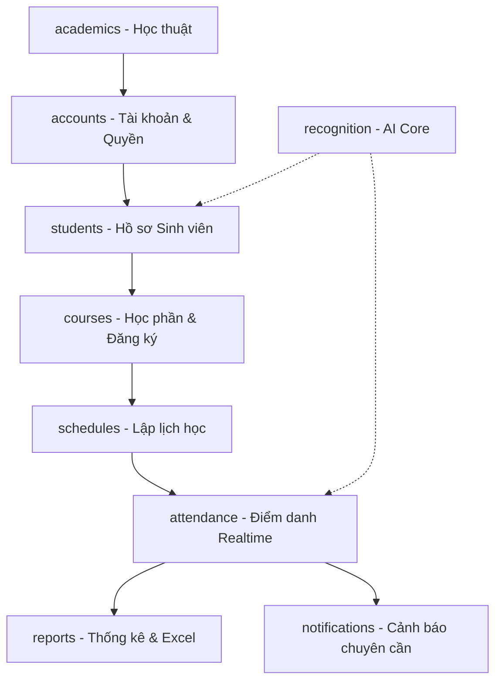

# Đặc Tả Tính Năng và Luồng Hoạt Động Hệ Thống EduFace

Tài liệu này cung cấp cái nhìn chi tiết và đặc tả kỹ thuật về các tính năng của từng module trong hệ thống **EduFace** (Hệ thống Điểm danh Sinh viên bằng Nhận diện Khuôn mặt), đồng thời mô tả các luồng hoạt động chính (Operational Flows) của hệ thống.

---

## 1. Bản Đồ Phân Hệ và Các Module Chi Tiết

Hệ thống được phát triển trên nền tảng Django và chia thành 8 phân hệ chính cùng một lõi nhận diện khuôn mặt độc lập:



---

## 2. Đặc Tả Chi Tiết Tính Năng Từng Module

### 2.1. Module Học Thuật Cốt Lõi (`academics`)
* **Mục tiêu:** Quản lý cấu trúc tổ chức đào tạo của trường đại học, làm nền tảng tham chiếu khóa ngoại cho sinh viên, giảng viên và lớp học phần.
* **Các Models:**
  - `Faculty` (Khoa): Mã khoa, Tên khoa.
  - `Department` (Ngành/Bộ môn): Mã ngành, Tên ngành, liên kết với Khoa.
  - `AcademicYear` (Năm học): Tên năm học, Ngày bắt đầu, Ngày kết thúc, Trạng thái hoạt động (`is_active`).
  - `Semester` (Học kỳ): Năm học liên kết, Số học kỳ (1, 2, 3), Ngày bắt đầu, Ngày kết thúc, Trạng thái hoạt động (`is_active`).
* **Các Quy tắc & Ràng buộc:**
  - Ràng buộc duy nhất trên `(academic_year, semester_num)` trong `Semester`.
  - Cơ chế xóa được bảo vệ (`on_delete=models.PROTECT`) ở các thực thể liên kết hạ nguồn để tránh mất dữ liệu liên đới.

### 2.2. Module Tài Khoản & Phân Quyền (`accounts`)
* **Mục tiêu:** Quản lý thông tin đăng nhập của người dùng, phân quyền truy cập chức năng và quản lý hồ sơ Giảng viên (`Teacher`).
* **Các Quy tắc & Ràng buộc:**
  - **Nhóm quyền (Groups):** Hệ thống định nghĩa sẵn 2 nhóm: `Admin` (Quản trị viên) và `Teacher` (Giảng viên).
  - **Middleware phân quyền:** `RoleFlagsMiddleware` tự động phân tích và gắn các cờ `request.is_admin_group` và `request.is_teacher_group` vào request để dễ dàng xử lý ẩn/hiện thành phần giao diện.
  - **Quyền Giảng viên (Teacher Scope):** Giảng viên chỉ được xem và tương tác với các Lớp học phần do mình trực tiếp giảng dạy. Mọi nỗ lực truy cập dữ liệu của lớp khác thông qua URL sẽ bị chặn lại ở mức View (trả về lỗi `PermissionDenied` - HTTP 403).
  - **Form đổi vai trò:** Cho phép thay đổi thông tin tài khoản và cập nhật mật khẩu an toàn.

### 2.3. Module Quản Lý Sinh Viên (`students`)
* **Mục tiêu:** Quản lý hồ sơ cá nhân và ảnh nhận diện của sinh viên.
* **Các Models:**
  - `StudentClass` (Lớp sinh hoạt): Mã lớp, Tên lớp, Ngành, Năm nhập học.
  - `Student` (Sinh viên): MSSV, Họ tên, Ngày sinh, Email, Sđt, Ảnh khuôn mặt (`photo`), Trạng thái còn học (`is_active`), liên kết với Lớp sinh hoạt.
* **Các Quy tắc & Ràng buộc:**
  - MSSV (`student_id`) là khóa duy nhất và bắt buộc.
  - **Import CSV:** Cho phép import hàng loạt sinh viên từ file CSV mẫu. Đã áp dụng `transaction.atomic()` lồng nhau để lưu thành công các dòng hợp lệ và ghi nhận chi tiết lỗi của các dòng không hợp lệ.
  - **Tự động huấn luyện (Signal AI):** Khi sinh viên được tạo mới hoặc cập nhật ảnh khuôn mặt thành công, Django signal `rebuild_face_encodings` sẽ tự động gọi hàm mã hóa khuôn mặt để cập nhật dữ liệu huấn luyện.

### 2.4. Module Học Phần và Đăng Ký (`courses`)
* **Mục tiêu:** Quản lý chương trình học phần, danh sách lớp học phần và quản lý việc đăng ký học.
* **Các Models:**
  - `Course` (Học phần): Mã học phần, Tên học phần, Số tín chỉ, Phòng học mặc định.
  - `CourseClass` (Lớp học phần): Liên kết với Học phần, Học kỳ, Giảng viên giảng dạy; Mã lớp học phần, Sĩ số tối đa (`max_students`), Tổng số buổi học (`total_sessions`).
  - `Enrollment` (Đăng ký học phần): Liên kết chéo giữa `CourseClass` và `Student`, trạng thái hoạt động (`is_active` - dùng khi sinh viên hủy học phần).
* **Các Quy tắc & Ràng buộc:**
  - Tổ hợp `(course, semester, class_code)` của Lớp học phần phải là duy nhất.
  - Khi thêm sinh viên vào lớp học phần, hệ thống kiểm tra: sinh viên không được trùng lặp đăng ký, lớp phải còn chỗ trống (`current_enrolled < max_students`).
  - Hỗ trợ import/export danh sách sinh viên đăng ký lớp học phần bằng CSV.

### 2.5. Module Lập Lịch Học (`schedules`)
* **Mục tiêu:** Thiết lập thời khóa biểu cho từng lớp học phần theo buổi cụ thể.
* **Các Models:**
  - `Room` (Phòng học): Mã phòng, Tòa nhà, Sức chứa, Có tích hợp camera nhận diện hay không.
  - `Schedule` (Lịch học theo buổi): Lịch học cụ thể cho một buổi học của lớp học phần, phòng học thực tế, thứ trong tuần, tiết bắt đầu, tiết kết thúc, ngày học cụ thể, số thứ tự buổi học (`session_number`).
* **Các Quy tắc & Ràng buộc:**
  - **Tạo lịch hàng loạt (Bulk Schedule):** Cho phép Admin chọn một khoảng thời gian (ngày bắt đầu/kết thúc), thứ trong tuần và các tiết học, hệ thống tự động sinh ra tất cả các buổi học (tương ứng từ buổi 1 đến buổi N).
  - **Chống trùng lịch:**
    1. Phòng học không được phép bị trùng tại cùng một thời điểm học (ngày học, tiết học).
    2. Một lớp học phần chỉ được có tối đa một buổi học trên một ngày cụ thể.

### 2.6. Module Điểm Danh Realtime (`attendance`)
* **Mục tiêu:** Thực hiện điểm danh tự động thông qua camera livestream hoặc hình ảnh tải lên.
* **Các Models:**
  - `AttendanceSession` (Buổi điểm danh): Liên kết với Lớp học phần và Buổi lịch học cụ thể. Có trạng thái "Đang mở" (`open`) hoặc "Đã đóng" (`closed`).
  - `AttendanceRecord` (Bản ghi điểm danh): Trạng thái của từng sinh viên trong buổi điểm danh (`present` - Có mặt, `absent` - Vắng, `late` - Đi trễ), phương thức thực hiện (`face` - Nhận diện khuôn mặt, `manual` - Giảng viên sửa thủ công), độ chính xác của AI (`confidence`), thời điểm nhận diện.
* **Các Quy tắc & Ràng buộc:**
  - Chỉ có các sinh viên đã được đăng ký học phần (`Enrollment`) và hoạt động mới được chấp nhận điểm danh trong buổi học đó.
  - Khi luồng video hoạt động, sinh viên được camera nhận diện thành công sẽ được tự động thêm vào `AttendanceRecord` là "Có mặt" và cập nhật realtime trên màn hình của giảng viên thông qua cơ chế AJAX polling / Server-Sent Events.
  - Giảng viên có quyền đóng buổi điểm danh bất cứ lúc nào. Khi đóng, trạng thái buổi điểm danh chuyển sang `closed`, hệ thống tự động khóa và tính toán kết quả chuyên cần.

### 2.7. Module Cảnh Báo Chuyên Cần (`notifications`)
* **Mục tiêu:** Tự động phát hiện và gửi cảnh báo đến giảng viên/quản trị viên khi sinh viên vắng quá số buổi quy định.
* **Các Models:**
  - `Notification`: Lưu trữ sinh viên bị cảnh báo, lớp học phần liên quan, số buổi vắng, tổng số buổi đã học, tỷ lệ vắng và loại cảnh báo.
* **Các Quy tắc & Ràng buộc:**
  - Có 2 mức cảnh báo:
    - **Cảnh báo vắng (Warning):** Tỷ lệ vắng $\ge 20\%$ tổng số buổi học đã diễn ra.
    - **Nguy hiểm vắng (Danger):** Tỷ lệ vắng $\ge 40\%$ tổng số buổi học đã diễn ra.
  - Trạng thái tự động: Nếu sinh viên đi học lại đầy đủ và tỷ lệ vắng giảm xuống dưới $20\%$, cảnh báo cũ sẽ tự động được xóa đi.

### 2.8. Module Thống Kê & Báo Cáo (`reports`)
* **Mục tiêu:** Tổng hợp dữ liệu chuyên cần, vẽ biểu đồ và xuất báo cáo Excel chất lượng cao.
* **Các Models:**
  - `AttendanceReport`: Lưu trữ thống kê lũy kế cho từng sinh viên trong từng lớp học phần (Tổng số buổi học, Số buổi có mặt, Vắng, Đi trễ, Tỷ lệ chuyên cần).
* **Các Quy tắc & Ràng buộc:**
  - Báo cáo chuyên cần của lớp học phần hiển thị dưới dạng bảng ma trận lưới (mỗi cột là một buổi học, mỗi hàng là một sinh viên).
  - Tích hợp biểu đồ thống kê số lượng sinh viên đi học/vắng theo từng buổi học.
  - **Xuất Excel:** Định dạng bảng Excel chuyên nghiệp, tự động tô màu trực quan (Xanh: Có mặt, Đỏ: Vắng, Vàng: Đi trễ, Cam: Tỉ lệ chuyên cần kém).

---

## 3. Quy Trình và Luồng Hoạt Động Của Hệ Thống (Flows)

Dưới đây là sơ đồ luồng hoạt động chính mô tả tương tác giữa Người dùng, Hệ thống Django, Cơ sở dữ liệu và Phân hệ xử lý AI.

### 3.1. Luồng 1: Chuẩn Bị Dữ Liệu và Huấn Luyện AI (Face Encoding Flow)
Quy trình nạp sinh viên mới và trích xuất vector đặc trưng khuôn mặt (128-d vector).

```
[Admin] ---> Thêm sinh viên mới + Upload ảnh ---> [Django Backend]
                                                         |
                                                 (Lưu DB & Lưu file ảnh)
                                                         |
                                                 (Kích hoạt Signal)
                                                         |
                                                         v
                                              [recognition/face_encoder]
                                                         |
                                                 (Chạy mô hình HOG)
                                                         |
                                           (Lưu vector đặc trưng vào encodings.pkl)
```

### 3.2. Luồng 2: Lập Lịch Học & Chuẩn Bị Buổi Điểm Danh
Quy trình giáo viên lên lịch và khởi tạo một ca điểm danh.

```
[Giảng viên/Admin] ---> Tạo lịch học bulk/lẻ ---> [Django Backend] ---> (Lưu DB Schedule)
         |
  (Đến giờ dạy)
         |
         v
  Chọn buổi lịch học ---> [Bắt đầu điểm danh] ---> [Khởi tạo AttendanceSession]
                                                         |
                                                         v
                                              (Trạng thái session = 'open')
```

### 3.3. Luồng 3: Điểm Danh Realtime Qua Camera (Realtime Attendance Flow)
Mô tả quá trình camera quét liên tục và khớp khuôn mặt tự động.

```
[Webcam Stream] ----------------------------> Đọc từng khung hình (Frame)
                                                      |
                                                      v
                                            [recognition/face_detector]
                                            (Tìm các vị trí khuôn mặt)
                                                      |
                                                      v
                                            [recognition/face_matcher]
                                            (So sánh khoảng cách vector)
                                                      |
                                           (Khoảng cách < 0.5? Khớp thành công)
                                                      |
                                                      v
                                           [Ghi nhận điểm danh tự động]
                                                      |
                                         (Tạo/Cập nhật AttendanceRecord)
                                                      |
                                                      v
                                      [Giao diện GV] tự động cập nhật (AJAX)
```

### 3.4. Luồng 4: Đóng Điểm Danh và Tạo Cảnh Báo (Session Closing & Notifications Flow)
Khi tiết học kết thúc, giảng viên đóng phiên điểm danh để hệ thống chốt kết quả và tính toán cảnh báo.

```
[Giảng viên] ---> [Kết thúc buổi điểm danh] ---> Cập nhật trạng thái session = 'closed'
                                                               |
                                                       (Kích hoạt Signal)
                                                               |
                                                               v
                                                   [reports/refresh_report]
                                                   (Tính toán lại tỉ lệ vắng)
                                                               |
                                                               v
                                                 [notifications/check_and_notify]
                                                               |
                             +---------------------------------+---------------------------------+
                             |                                 |                                 |
                     Tỉ lệ vắng >= 40%                 Tỉ lệ vắng >= 20%                  Tỉ lệ vắng < 20%
                             |                                 |                                 |
                             v                                 v                                 v
                     [absent_danger]                   [absent_warning]                   [Xóa cảnh báo cũ]
```

---

## 4. Ma Trận Phân Quyền Người Dùng (Role Matrix)

| Chức năng | Vai trò: Quản Trị Viên (Admin) | Vai trò: Giảng Viên (Teacher) |
| :--- | :---: | :---: |
| **Quản lý danh mục học thuật** (Khoa, Ngành, Học kỳ) | Toàn quyền (Thêm, Sửa, Xóa) | Chỉ xem |
| **Quản lý tài khoản người dùng** | Toàn quyền (Thêm, Sửa, Xóa) | Không được phép truy cập |
| **Quản lý Sinh viên & Lớp sinh hoạt** | Toàn quyền (CRUD, Import CSV) | Chỉ xem |
| **Quản lý Học phần & Lớp học phần** | Toàn quyền (Thêm, Sửa, Xóa) | Chỉ xem lớp mình dạy |
| **Quản lý Lịch học & Lập lịch** | Toàn quyền (Bulk Create, Sửa, Xóa) | Chỉ xem thời khóa biểu cá nhân |
| **Tạo ca điểm danh & Bật camera** | Có (Hỗ trợ) | Có (Chính) - Chỉ lớp mình dạy |
| **Chỉnh sửa kết quả điểm danh thủ công** | Có | Có - Chỉ lớp mình dạy |
| **Xem cảnh báo vắng mặt** | Toàn hệ thống | Chỉ xem cảnh báo sinh viên lớp mình dạy |
| **Xem báo cáo & Xuất Excel** | Toàn hệ thống | Chỉ xuất báo cáo lớp mình dạy |
